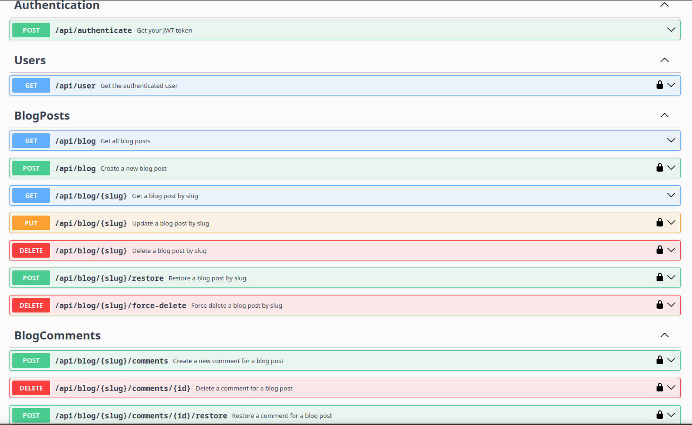

# Bohemia Interactive Blog API
This is an API app built with Laravel Sanctum and Swagger UI.
Built with a linter (pint), PHPUnit tests and Github actions for CI.
For the full swagger API interface, visit http://localhost/api/documentation in your browser.

## Start the project
1. Copy the .env.example file and rename it to .env
```bash
    cp .env.example .env
```

2. Install sail and dependencies
```bash
docker run --rm \
    -u "$(id -u):$(id -g)" \
    -v $(pwd):/var/www/html \
    -w /var/www/html \
    laravelsail/php81-composer:latest \
    composer install --ignore-platform-reqs
```

3. Launch the sail ⛵
```bash
./vendor/bin/sail up
```

4. In a new terminal, run the migrations and seeders
```bash
./vendor/bin/sail artisan migrate:fresh --seed
```

5. Generate the app key
```bash
./vendor/bin/sail artisan key:generate
```

6. Consult the documentation by visiting http://localhost/api/documentation in your browser
   




## Help:
To run the linter, run the following command:
```bash
./vendor/bin/pint
```

To run the tests, run the following command:
```bash
./vendor/bin/sail php artisan test
```

Don't forget to check the 404 page out, it's pretty cool 😎


## Creds
Built with ❤️ on Arch Linux by [Sergey Musiyenko](https://sy.mk)